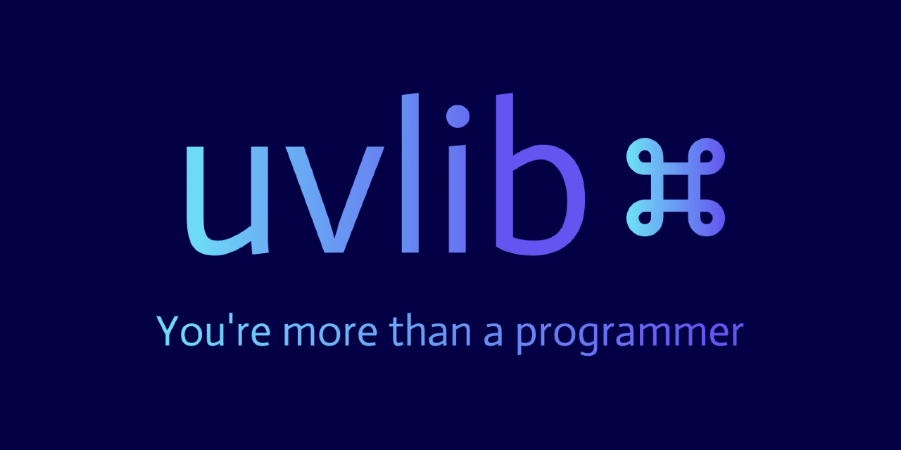

<div align="center">
  <!-- Build & Release -->
  
  
  
  
  
  
</div>


uvlib is an open-source PROS library that brings the Command-Based Programming paradigm to V5 Robotics in an creative and intuitive way.
* **Declarative**: You're more than just a programmer; you're a designer and an engineer. Just explain what you want done, let uvlib worry about the how.
* **Command-Based**: Rediscover the DRY principle—the oldest, and perhaps most important, programming concept—all over again in PROS. Keep your code clean, organized, and reusable across multiple seasons.
* **Extensible**: Built to grow with your projects. Easily integrate new features, customize behaviors, and adapt uvlib to your evolving needs.

<br>

>[!IMPORTANT]
> uvlib is still heavily under development. Expect lots of bugs, drastic changes, and unexpected instability. Please [create an issue](https://github.com/SomewhatMay/uvlib/issues/new) if you encounter any bugs.

## 📦 Installation 
### ✅ Automatic Installation (recommended)
Installing is as simple as 1, 2, and 3:
```bash
pros c add-depot uvlib https://raw.githubusercontent.com/SomewhatMay/uvlib/refs/heads/depot/stable.json # adds the remote depot
pros c apply uvlib # installs uvlib into your current project
```
3. Start coding!

### ⬇️ Manual installation (not recommended)
1. Download the [latest release from GitHub releases](https://github.com/SomewhatMay/uvlib/releases)
2. Unzip the compressed archive
3. Copy and paste the contents of the file into your project directory

### 🔄️ Updating
If you've already got uvlib and would like to switch to the latest version, simply run:
```bash
pros c update
```

### ❌ Uninstalling
We're sorry to see you go. If you've encountered an problem, be sure to [create an issue](https://github.com/SomewhatMay/uvlib/issues). To uninstall, simply run:
```bash
pros c uninstall uvlib
```

## 📖 Documentation
*Documentation is currently under work. Every class and method is well-documented; see the header files in* [`include/uvlib/`](include/uvlib)*.*

To see very basic example robot code with a Drivetrain subsystem, commands, and Controller triggers, [see the example.cpp](src/example.cpp).

## 🔥 Inspiration
Much of this project was inspired by [WPILib](https://docs.wpilib.org/en/stable/index.html) and its Command-Based Programming structure. WPILib is the library trusted by hundreds of FIRST Robotics teams worldwide. Many of the design decisions were made to align with WPILib's implementation. You can learn more about the paradigm [here](https://docs.wpilib.org/en/stable/docs/software/commandbased/index.html).

## License
This project is licensed under the Apache-2.0 license. See [LICENSE](LICENSE) for further details.

This project, its contributors, and its use of any trademarks or registered trademarks are not partnered with PROS, Purdue University, VEX Robotics (VRC), or any affiliated organizations. All trademarks and registered trademarks are the property of their respective owners and are used with proper attribution for educational and non-commercial purposes only. No endorsement by the aforementioned organizations is implied.
